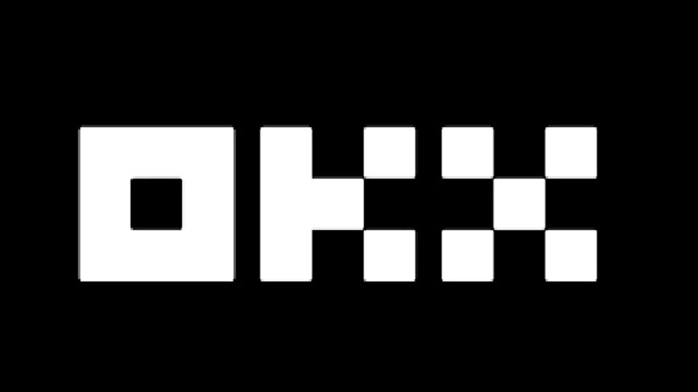

# OKX交易平台完整指南：开户、服务与费用全解析

---

在加密货币交易这个圈子里，选对平台就像选对跑鞋——合脚的能让你跑得又快又稳。OKX（原OKEx）就是那双"合脚"的鞋。这篇文章会告诉你，为什么全球200多个国家的用户都在用它，以及怎么用好它。

---

## 先说说OKX是个什么来头

OKX成立于2017年，现在已经是全球最大的加密货币交易平台之一。每天的交易量超过15亿美元，支持348种数字货币交易。这不是吹牛，而是实打实的数据。

**官网地址：** 👉 [点击这里注册OKX，使用邀请码62834398获取专属优惠](https://www.okx.com/join/62834398)

平台的核心优势很简单：
- 覆盖200+国家和地区
- 支持348种加密货币
- 日交易量超15亿美元
- 在加密货币交易所排行榜上稳居前列

## 为什么这么多人选择OKX？

说实话，交易平台多得是，但OKX能脱颖而出，靠的是这几点：

**交易品种够全**  
比特币、以太坊、瑞波币、莱特币这些主流币种自不必说，各种山寨币、期货合约、大宗商品、指数产品也一应俱全。想交易什么基本都能找到。

**安全措施到位**  
平台用的是银行级别的加密技术，多重安全协议保护用户资金。这年头，安全比什么都重要。

**24小时客服在线**  
遇到问题随时能找到人。技术团队响应速度快，基本上问题都能当天解决。

**数据分析工具专业**  
提供各种图表、技术指标、市场统计数据。想做技术分析的话，这些工具够用了。

**界面简洁好用**  
新手也能很快上手。按钮位置合理，功能分类清晰，不会让人觉得眼花缭乱。

**交易执行速度快**  
订单几乎是秒成交。在加密货币市场，速度就是金钱。

**信誉过硬**  
运营这么多年，口碑一直不错。用户信任度高，这在币圈是很难得的。

## OKX提供哪些服务？

平台的服务体系挺完善的，主要包括：

**现货交易**  
直接买卖加密货币，价格实时更新，随时可以交易。

**合约交易**  
想做杠杆交易的话，期货合约、永续合约都有。不过风险也大，新手慎入。

**充值提现**  
支持多种加密货币充值，也可以用电子支付。提现速度快，一般几小时内到账。

**专业分析工具**  
K线图、深度图、技术指标一应俱全。想研究市场走势的话，这些工具很有用。

**安全保障**  
冷热钱包分离存储，多重签名验证，资金安全有保障。

## OKX的发展前景怎么样？

从行业趋势来看，OKX一直在做两件事：

第一，不断升级服务。新功能、新币种、新交易对定期上线，始终保持竞争力。

第二，扩大市场覆盖。不断开拓新的国家和地区，让更多人能用上平台服务。

从这个角度说，OKX不是在吃老本，而是在持续进化。对于想长期玩币的人来说，选择一个有发展前景的平台很重要。

## 怎么在OKX开户？

开户流程其实挺简单的，跟着步骤走就行：

**第一步：访问官网**  
打开 [OKX官网](https://www.okx.com/join/62834398)，点击"注册"按钮。

**第二步：填写基本信息**  
输入邮箱、设置密码。密码要设复杂点，加上数字、字母、符号混合。

**第三步：验证邮箱**  
去邮箱里找验证邮件，点击链接激活账户。

**第四步：完善个人资料**  
填写手机号、地址等信息。这是监管要求，必须填真实信息。

**第五步：身份认证**  
上传身份证或护照照片。平台需要验证你的身份，这是反洗钱要求。

**第六步：开始交易**  
认证通过后就能充值、交易了。

提醒一下：身份认证一定要认真填，信息错误会影响后续提现。另外，平台的安全设置（双重验证、交易密码等）最好都开启，多一层保护总是好的。

## OKX的手续费怎么算？

手续费这事儿得说清楚，毕竟关系到真金白银。

**现货交易手续费**  
maker费率和taker费率在0.1%到0.15%之间。交易量越大，费率越低。

**期货合约手续费**  
一般在0.03%到0.05%之间。👉 [注册后使用邀请码62834398可以享受手续费折扣](https://www.okx.com/join/62834398)

**期权交易手续费**  
同样是0.03%到0.05%的区间。

**手续费优惠**  
用平台币（OKB）支付手续费可以打折。持仓量大的用户还能享受VIP费率。

建议交易前先看看费率表，算清楚成本。频繁交易的话，手续费也是笔不小的开支。

## 充值、提现、交易有什么要求？

**关于身份认证**  
开户后必须完成KYC认证（上传身份证件和个人信息）。这是国际反洗钱规定，所有正规平台都要求。

**关于充值**  
支持各种主流加密货币充值，也支持法币入金（具体看地区）。充值一般没有最低限额，但网络确认时间不同。

**关于提现**  
提现需要设置资金密码和双重验证。最低提现额度根据币种不同而不同，到账时间通常在几小时内。

**关于交易**  
现货交易随时可以进行，合约交易需要开通权限。新手建议先从现货开始，熟悉了再玩合约。

记住一点：所有操作都要遵守平台规则，不要尝试违规操作。平台监控系统很严格，异常交易会被冻结账户。

---

## 总结：OKX适合你吗？

说了这么多，简单总结一下：

OKX是个成熟、安全、功能全面的加密货币交易平台。无论你是想买几个比特币长期持有，还是想做短线合约交易，这个平台都能满足需求。手续费合理，服务稳定，覆盖范围广。

对于新手来说，平台界面友好，有中文客服支持。对于老手来说，交易工具专业，流动性充足。这就是为什么全球那么多用户选择OKX的原因——它确实够用、好用、耐用。

想要开始你的加密货币交易之旅吗？👉 [立即注册OKX，使用邀请码62834398](https://www.okx.com/join/62834398)，开启更高效、更安全、更专业的交易体验。
